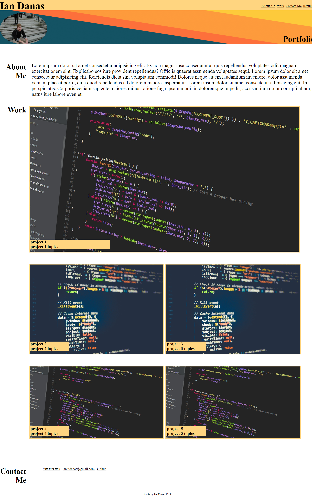

# Challenge-02
## Description

This project serves as a homepage for a potential employer to work view my current deployed portfolio of work samples. This will help employers’ assess whether I am a good candidate for a potential open position. There is a brief bio section with some information about myself, A work section of links to projects which will be updated once I have completed more (currently each one links to the challenge 2 github repo), and a contact section with ways to contact me. This webpage also serves to show what I've learned in the CSS portion of this class by combining key concepts. These include flexbox, responsive layout through media queries and basic CSS design concepts. 
## Installation
N/A

## Usage
deployed website can be found at : https://ian-danas.github.io/Challenge-02/

## Credits
Images found on https://www.pexels.com/search/coding/\ https://unsplash.com/s/photos/banner

## License
na
